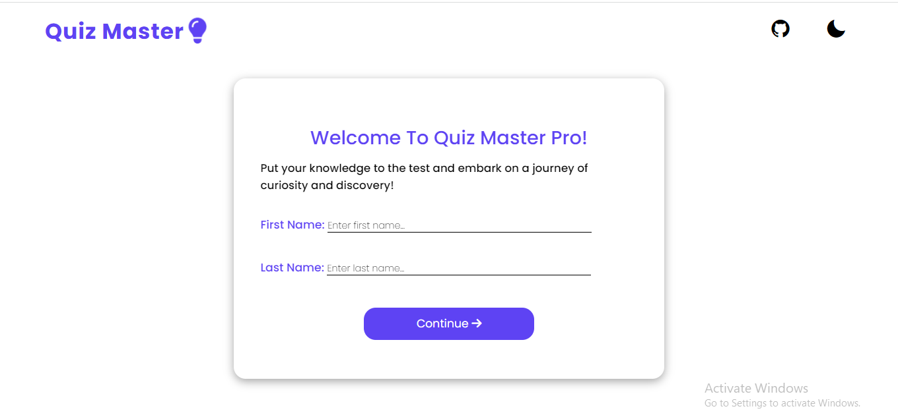
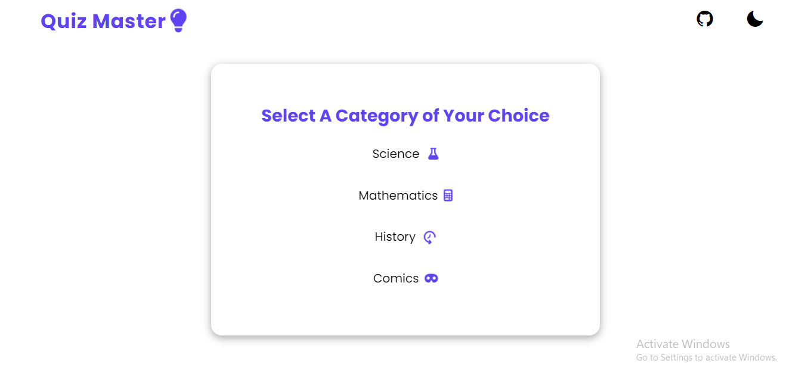
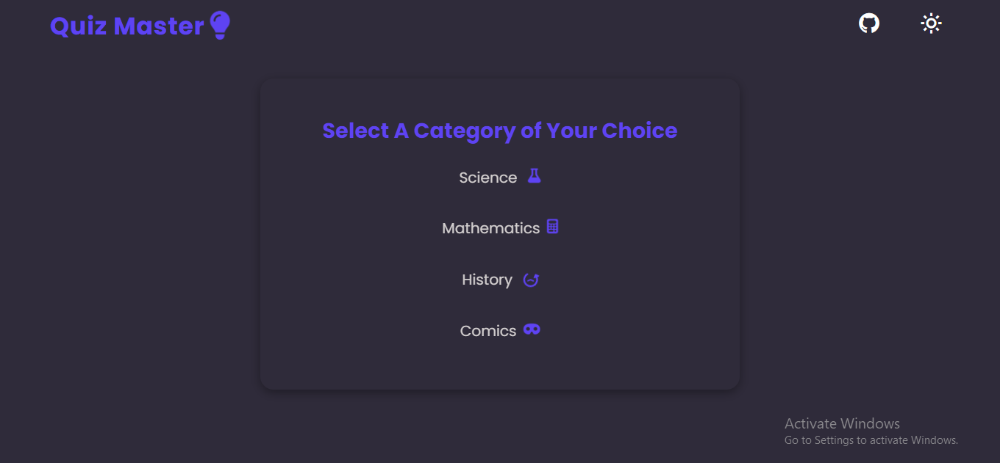
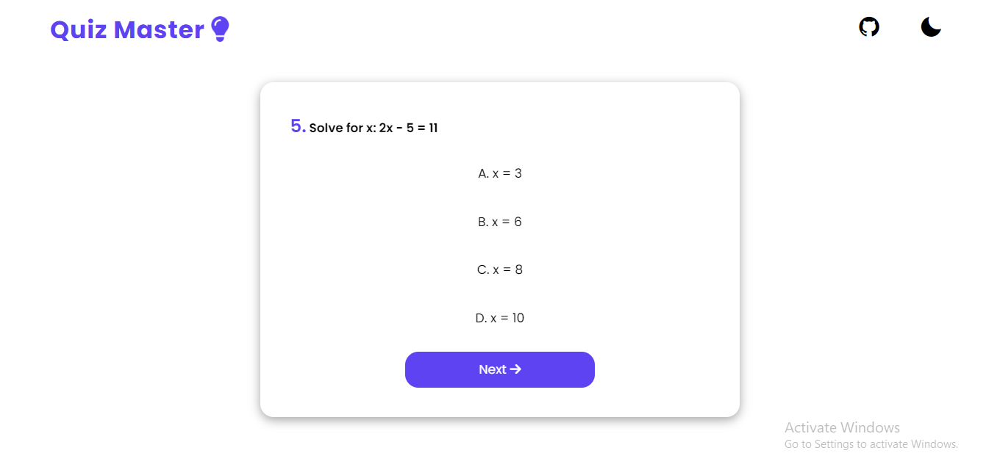
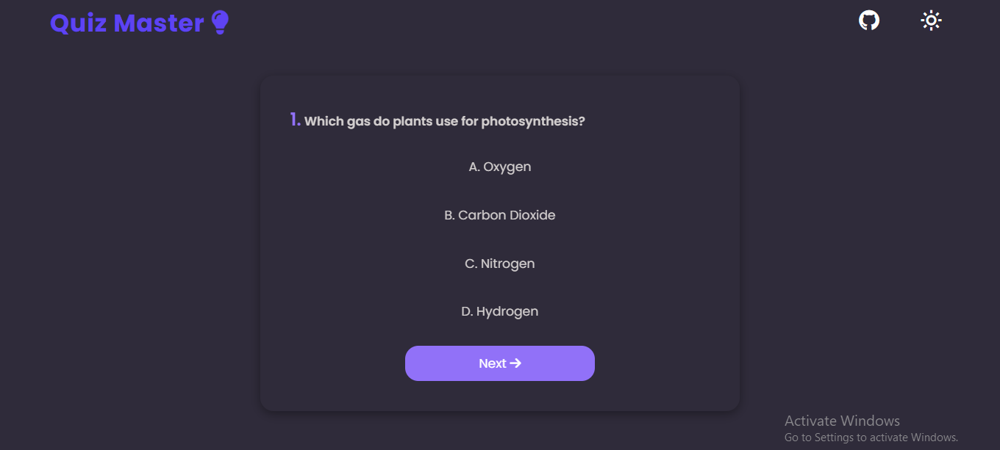
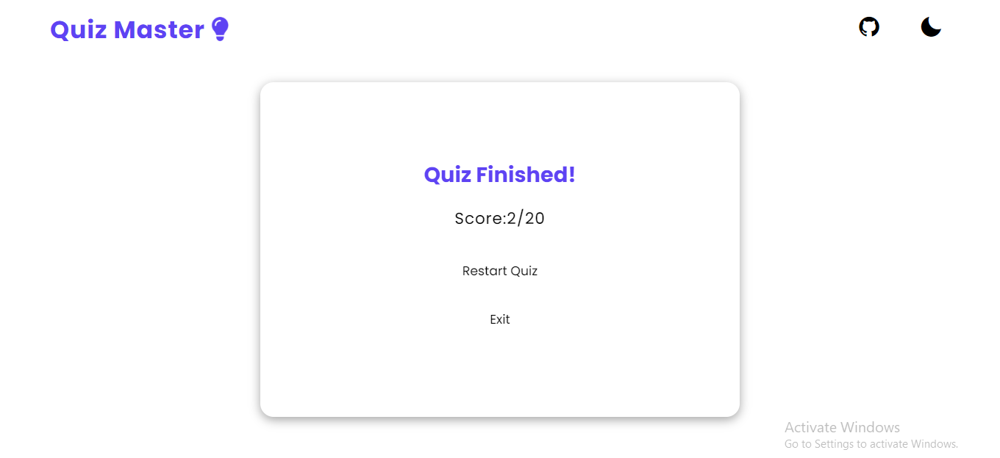

# Quiz Master

Welcome to the Quiz App, a web application built with React and Vite that lets you test your knowledge in various categories!

## Features

- Choose from four quiz categories: Science, Math, History, and Comics.
- Toggle between Light Mode and Dark Mode for comfortable viewing.
- Answer multiple-choice questions and get instant feedback.
- Track your score and progress as you take the quiz.
- Responsive design for seamless usage on different devices.

## Getting Started

Follow these steps to get the project up and running on your local machine:

1. Clone the repository: `git clone https://github.com/chrismbah/Quiz-Master.git`
2. Navigate to the project directory: `cd quiz-master`
3. Install dependencies: `npm install`
4. Start the development server: `npm run dev`

The app should now be accessible at `http://localhost:5173`.

## Usage

- Input your first name and last name
- Choose a category from the homepage to start a quiz.
- Read the question and select the correct answer.
- Get immediate feedback on your answer.
- View your score at the end of the quiz.

## Dark Mode

The Quiz App includes a Dark Mode feature for enhanced usability in low-light environments.

## Technologies Used

- React
- Vite
- CSS (for styling)
- Framer Motion (for animation)

## Screenshots

---

Feel free to reach out to me at mbahchris46@gmail.com if you have any questions or feedback!
